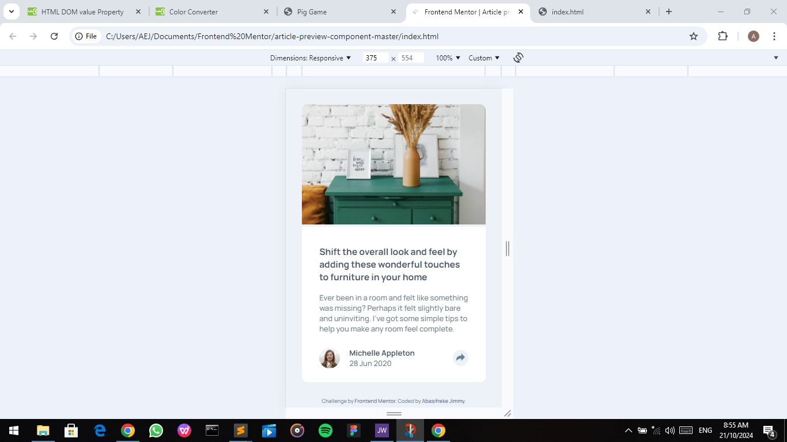
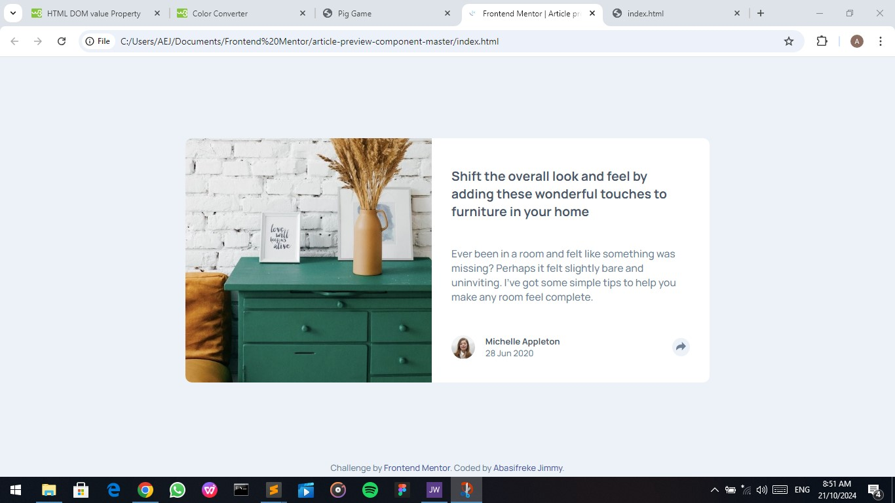

# Frontend Mentor - Article preview component solution

This is a solution to the [Article preview component challenge on Frontend Mentor](https://www.frontendmentor.io/challenges/article-preview-component-dYBN_pYFT).

## Table of contents

- [Overview](#overview)
  - [The challenge](#the-challenge)
  - [Screenshot](#screenshot)
  - [Links](#links)
- [My process](#my-process)
  - [Built with](#built-with)
  - [What I learned](#what-i-learned)
  - [Continued development](#continued-development)
  - [Useful resources](#useful-resources)
- [Author](#author)
- [Acknowledgments](#acknowledgments)


## Overview

### The challenge

Users should be able to:
- View the optimal layout for the component depending on their device's screen size
- See the social media share links when they click the share icon

### Screenshot




### Links

- Solution URL: (https://github.com/Abas-code/article-preview-component-master)
- Live Site URL: (https://article-preview-component-master-chi-eight.vercel.app/)

## My process

### Built with

- Semantic HTML5 markup
- CSS custom properties
- Flexbox
- Mobile-first workflow
- JavaScript

### What I learned

I learnt how to use svgs properly, which has helped me manipulate it in Javascript. I also learnt that hexadecimals don't work in JavaScript.

```html
<div class="share">
  <svg xmlns="http://www.w3.org/2000/svg" width="15" height="13" fill="rgb(110, 128, 152)" class="share-svg">
    <path d="M15 6.495L8.766.014V3.88H7.441C3.33 3.88 0 7.039 0 10.936v2.049l.589-.612C2.59 10.294 5.422 9.11 8.39 9.11h.375v3.867L15 6.495z"/>
  </svg>
</div>
```
```js
function toggle() {
  if (ssvg.style.fill === "rgb(110, 128, 152)") {
    links.style.display = "flex";
    ssvg.style.fill = "white";
    share.style.backgroundColor = "#6d7f97";
  } else {
    links.style.display = "none";
    ssvg.style.fill = "rgb(110, 128, 152)";
    share.style.backgroundColor = "rgb(236, 242, 248)";
  }
}
```

### Continued development

I'm still learning how to use CSS Grid. JavaScript has been added to the mix.

### Useful resources

- [W3Schools](https://www.w3schools.com)


## Author

- Frontend Mentor - [@Abascode](https://www.frontendmentor.io/profile/Abascode)


## Acknowledgments

I want to acknowledge those who have been of great help to me from the Frontend community.